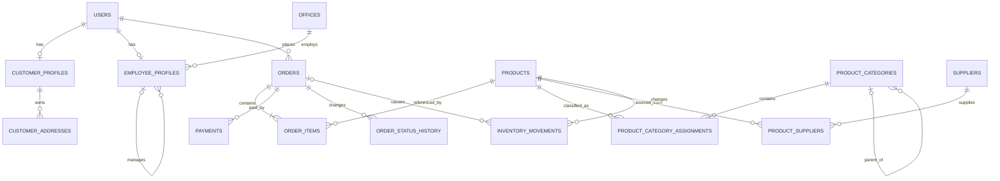

# Thiết kế cơ sở dữ liệu chuẩn hóa

## 1. Phạm vi

Schema được mở rộng theo cách tổ chức của `classicmodels`, nhưng điều chỉnh cho dịch vụ bán hàng trực tuyến:

- `users`, `customer_profiles`, `customer_addresses` tương ứng miền khách hàng;
- `offices`, `employee_profiles` tương ứng văn phòng và nhân viên;
- `product_categories`, `products`, `suppliers` tương ứng product lines, sản phẩm và vendor;
- `orders`, `order_items`, `payments` tương ứng đơn hàng, chi tiết đơn và thanh toán;
- `order_status_history`, `inventory_movements` lưu lịch sử thay đổi.



## 2. Khóa và phụ thuộc hàm chính

| Quan hệ | Khóa chính | Khóa ứng viên khác | Phụ thuộc hàm chính |
|---|---|---|---|
| `users` | `id` | `email` | `id → toàn bộ thuộc tính`, `email → toàn bộ thuộc tính` |
| `offices` | `id` | `office_code` | mỗi khóa ứng viên xác định toàn bộ dòng |
| `employee_profiles` | `user_id` | `employee_code` | mỗi khóa ứng viên xác định toàn bộ hồ sơ nhân viên |
| `customer_profiles` | `user_id` | — | `user_id → phone, date_of_birth, credit_limit` |
| `customer_addresses` | `id` | — | `id → toàn bộ địa chỉ` |
| `product_categories` | `id` | `category_code`, `name` | mỗi khóa ứng viên xác định toàn bộ danh mục |
| `suppliers` | `id` | `supplier_code` | mỗi khóa ứng viên xác định toàn bộ nhà cung cấp |
| `products` | `id` | `sku` | mỗi khóa ứng viên xác định toàn bộ sản phẩm |
| `product_category_assignments` | `(product_id, category_id)` | — | cặp khóa xác định thời điểm gán |
| `product_suppliers` | `(product_id, supplier_id)` | `(supplier_id, supplier_sku)` khi SKU khác NULL | khóa xác định giá nhập và thời gian giao |
| `orders` | `id` | `order_code` | mỗi khóa ứng viên xác định toàn bộ đơn |
| `order_items` | `id` | `(order_id, product_id)` | mỗi khóa ứng viên xác định snapshot và số lượng |
| `payments` | `id` | `payment_code`, `provider_transaction_id` khi khác NULL | mỗi khóa xác định toàn bộ giao dịch |
| `order_status_history` | `id` | — | `id → toàn bộ lần chuyển trạng thái` |
| `inventory_movements` | `id` | `reference_code` khi khác NULL | mỗi khóa xác định toàn bộ biến động kho |

## 3. Chuẩn 1NF

- Mỗi bảng có khóa chính.
- Mỗi ô chứa một giá trị nguyên tử; không lưu danh sách category, supplier hoặc payment trong một cột.
- Quan hệ nhiều-nhiều được tách thành `product_category_assignments` và `product_suppliers`.
- Địa chỉ được tách thành các thành phần riêng trong `customer_addresses` và `offices`.

## 4. Chuẩn 2NF

- Các bảng khóa đơn hiển nhiên đạt 2NF.
- Trong hai bảng khóa ghép, mọi thuộc tính không khóa phụ thuộc vào toàn bộ khóa:
  - `assigned_at` mô tả đúng cặp sản phẩm–danh mục;
  - `purchase_price`, `supplier_sku`, `lead_time_days`, `is_preferred` mô tả đúng cặp sản phẩm–nhà cung cấp.
- Không có thuộc tính chỉ phụ thuộc riêng `product_id` hoặc riêng `supplier_id` trong các bảng nối.

## 5. Chuẩn 3NF

- Thông tin đăng nhập nằm trong `users`; dữ liệu riêng của customer và employee nằm ở bảng profile.
- Thông tin văn phòng không lặp trong `employee_profiles`.
- Tên và liên hệ nhà cung cấp không lặp trong `products`.
- Tên danh mục không lặp trong `products`; quan hệ phân loại nằm ở bảng nối.
- Dữ liệu thanh toán, địa chỉ và lịch sử trạng thái không được nhét vào `orders`.
- Không có phụ thuộc bắc cầu giữa các thuộc tính không khóa trong từng quan hệ.

## 6. BCNF

Với các phụ thuộc hàm nghiệp vụ đã liệt kê, mọi định thức trong mỗi bảng đều là một khóa ứng viên. Vì vậy các quan hệ đạt BCNF.

Hai điểm cần hiểu đúng:

1. `order_items.product_name` và `unit_price` là **snapshot lịch sử**. `product_id` không xác định chúng xuyên thời gian, vì một sản phẩm có thể đổi tên hoặc giá giữa các đơn hàng.
2. `line_total` không được lưu trong bảng. API tính `unit_price × quantity`; view `v_order_calculated_totals` tính tổng từ chi tiết, loại bỏ phụ thuộc dẫn xuất trong `order_items`.

`orders.total_amount` là tổng tiền đã chốt tại thời điểm giao dịch và phụ thuộc vào khóa đơn hàng. View kiểm tra cho phép so sánh nó với tổng tính lại từ các dòng chi tiết.

## 7. Toàn vẹn dữ liệu

- `PRIMARY KEY`: nhận diện duy nhất mỗi dòng.
- `UNIQUE`: bảo vệ email, SKU, mã đơn, mã thanh toán, mã danh mục, mã nhà cung cấp.
- `FOREIGN KEY`: bảo vệ quan hệ và ngăn bản ghi mồ côi.
- `CHECK`: giá và số lượng hợp lệ, tồn kho không âm, chuyển kho cân bằng, quốc gia đúng định dạng.
- `ON DELETE RESTRICT`: giữ lịch sử đơn, thanh toán và kho.
- `ON DELETE CASCADE`: chỉ dùng cho dữ liệu phụ thuộc hoàn toàn như địa chỉ hoặc bảng nối.
- Index được đặt trên khóa ngoại và các trường thường lọc như status, thời gian và thành phố.

Các quy tắc xuyên nhiều bảng như “user đặt đơn phải có role CUSTOMER”, “tổng payment PAID không vượt tổng đơn” và luồng trạng thái đơn được kiểm soát ở tầng nghiệp vụ trong một transaction.
Các quy tắc chống tự tham chiếu như “nhân viên không tự làm quản lý” và “danh mục không tự làm cha” được kiểm soát ở tầng nghiệp vụ vì MySQL không cho cùng cột vừa dùng `CHECK` vừa dùng foreign key `ON DELETE SET NULL`.

## 8. Truy vấn kiểm tra

```sql
-- Đơn nào có tổng lưu khác tổng tính từ chi tiết?
SELECT *
FROM v_order_calculated_totals
WHERE recorded_total <> calculated_total;

-- Sản phẩm và danh mục
SELECT * FROM v_product_catalog ORDER BY id;

-- Kiểm tra bản ghi mồ côi (kết quả đúng là 0 dòng)
SELECT oi.*
FROM order_items oi
LEFT JOIN orders o ON o.id = oi.order_id
WHERE o.id IS NULL;
```
