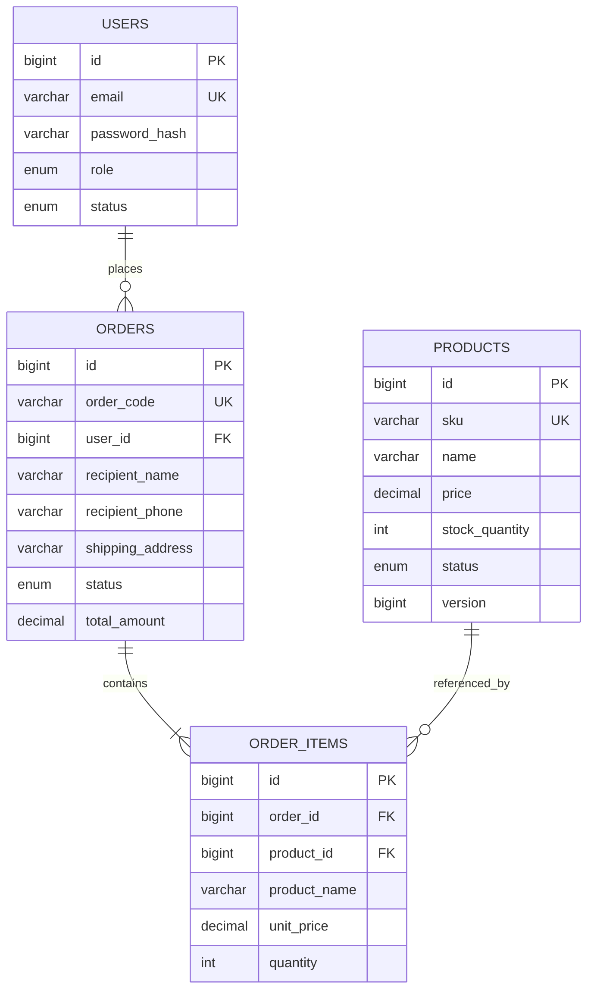
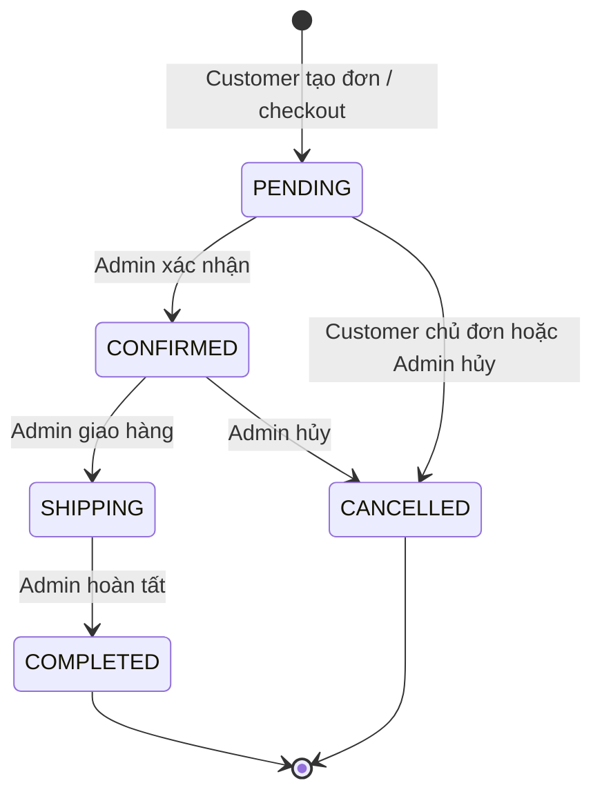

# Thiết kế lõi và luồng đơn hàng

## ERD bốn bảng lõi



`users.email`, `products.sku` và `orders.order_code` là duy nhất. Giá lớn hơn 0, tồn kho không âm, số lượng mua ít nhất 1. Cặp `(order_id, product_id)` trong `order_items` là duy nhất. `product_name` và `unit_price` là snapshot lúc mua; API tính `lineTotal = unitPrice × quantity`. `orders.total_amount` được server chốt từ các dòng hàng, client không được gửi tổng tiền. Xóa sản phẩm là soft delete (`INACTIVE`), không xóa vật lý lịch sử đơn hàng. Sơ đồ mở rộng và phân tích chuẩn hóa nằm ở [`../database/NORMALIZATION.md`](../database/NORMALIZATION.md).

## Kiến trúc ứng dụng

```text
HTTP JSON / Swagger
       ↓
Spring MVC Controller  ── Spring Security JWT filter (401/403)
       ↓
Application Service (quy tắc nghiệp vụ, transaction qua port)
       ↓
Repository / Store interfaces (application/port/out)
       ↓
JPA hoặc JdbcTemplate adapter ── MySQL sales_service / H2 test
```

`domain` và `application/service` không import Spring MVC hay thư viện DB. MySQL dùng Flyway để tạo/nâng schema; Hibernate chỉ `validate`. H2 dành cho chạy nhanh và integration test, không có đầy đủ trigger lịch sử của MySQL.

## Luồng trạng thái đơn hàng



- Tạo đơn `PENDING`: kiểm tra tồn kho, chốt giá/tổng tiền, trừ kho và ghi `SALE` trong cùng transaction.
- Customer chỉ được hủy đơn của chính mình khi còn `PENDING`; admin có thể hủy từ `PENDING` hoặc `CONFIRMED`. Hủy hoàn kho và ghi `SALE_REVERSAL` đúng một lần. Nếu đã có tiền `PAID`, phải chuyển khoản thanh toán sang `REFUNDED` trước.
- `SHIPPING` không được hủy; chỉ chuyển `COMPLETED`. `COMPLETED` và `CANCELLED` là trạng thái cuối. Chuyển sai trả `409`. Admin gửi lại trạng thái hiện tại nhận `200`; customer hủy lại nhận `409`. Cả hai trường hợp đều không hoàn kho lần nữa.
- Trên MySQL, trigger ghi `order_status_history`; trên H2 test, endpoint history có thể trả danh sách rỗng.
